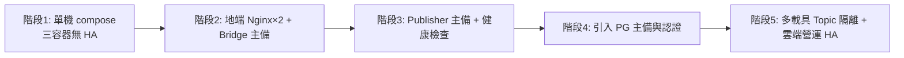
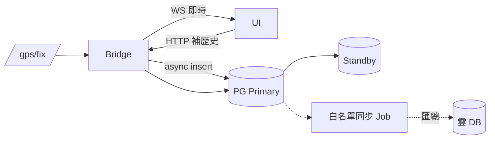
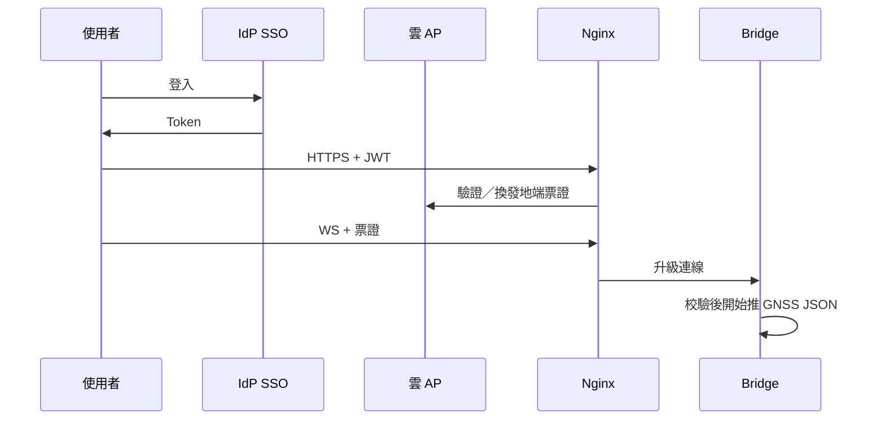
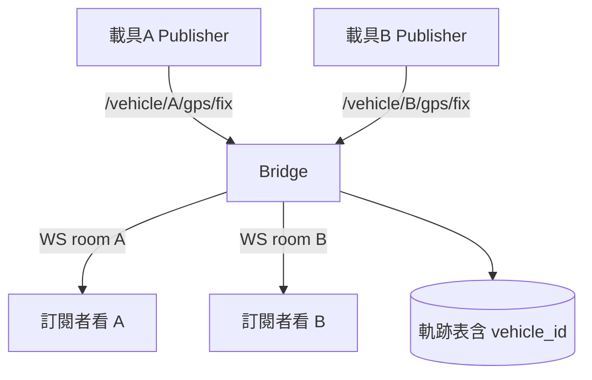

# Advance — 延伸情境與現行需求的 HA 實現

> 核心 MVP **不要求**持久化 DB、認證、多載具。  
> 本文描述產品化後如何補上這些能力，並**聚焦：現行三服務架構如何設計 HA**。

---

## 0. 現行需求回顧（HA 的對象）

現行必備鏈路：

| 服務 | 職責 | 狀態特性 |
|------|------|----------|
| **Publisher** | 讀 CSV，5Hz 發 `NavSatFix` → `/gps/fix` | 有狀態（讀檔游標／循環索引） |
| **Backend（AP Bridge）** | 訂閱 Topic → JSON → WebSocket 廣播 | 半有狀態（WS 連線集合；可無 DB） |
| **Frontend** | 地圖當前點 + 歷史折線 | 瀏覽器端狀態；靜態資產無狀態 |

HA 目標（演示／艦隊級可分開談）：

- **可用性**：單節點掛掉，監控畫面可在 RTO 目標內恢復（例如 < 1 分鐘）。  
- **資料正確**：不因雙活躍 Publisher 造成「跳點／重軌」。  
- **可回滾**：壞映像可退回上一簽章版本（見 `README.md` CI/CD）。

---

## 1. 現行需求如何實現 HA（主文）

### 1.1 總覽

```mermaid
flowchart TB
  subgraph Entry["入口層 HA"]
    VIP[VIP / LB]
    NGX1[Nginx-1]
    NGX2[Nginx-2]
    VIP --> NGX1
    VIP --> NGX2
  end

  subgraph APLayer["AP / Bridge 層 HA"]
    Active[Bridge Active<br/>訂閱 ROS + WS]
    Standby[Bridge Standby<br/>熱備不搶領導]
    Active sn -->|failover| Standby
  end

  subgraph ROSLayer["ROS 層 HA"]
    PubA[Publisher Active]
    PubB[Publisher Standby]
    Topic["/gps/fix"]
    PubA --> Topic
    PubB -.->|接管後才發佈| Topic
  end

  subgraph DataLayer["資料層 HA（延伸）"]
    PG1[(PG Primary)]
    PG2[(PG Standby)]
    PG1 --> PG2
  end

  NGX1 --> Active
  NGX2 --> Active
  Topic --> Active
  Active --> PG1
```

### 1.2 分層做法（對應 Nginx / AP / DB）

#### A. Nginx（入口）— 無狀態，易 HA

| 項目 | 設計 |
|------|------|
| 拓撲 | ≥2 實例 + LB（雲 NLB／地端 Keepalived VIP） |
| 職責 | TLS 終止、`/ws` Upgrade、靜態 Frontend、反向代理到 Bridge |
| 健康檢查 | `GET /healthz`（由 AP 提供）失敗則摘除節點 |
| 說明 | 現行 compose 可先單 Nginx；艦隊部署再雙節點 |

#### B. AP / FastAPI Bridge — 半有狀態，建議「單活躍 + 熱備」

現行 Bridge 同時做兩件事：**DDS 訂閱**與 **WebSocket 連線管理**。水平亂擴會遇到：

1. 多個 Bridge 都訂閱 `/gps/fix` → 沒問題（DDS 允許多訂閱者），但…  
2. 前端只連其中一個；LB 若無黏性，重連可能換實例 → **瀏覽器歷史折線需靠前端 buffer 或改由 DB 補**。  
3. 若誤做成「多活躍且前端廣播風扇出」，架構變複雜，超出現行題面。

**建議 HA 模式（現行需求優選）：**

| 模式 | 作法 | 適用 |
|------|------|------|
| **Active / Standby** | 領導選舉（輕量：Redis lock／k8s lease／Patroni 風格 lease）；僅 Active 對外掛 WS；Standby 就緒但不接流量或接了也不訂閱 | **推薦** 面試主方案 |
| **Active / Active + Sticky** | LB cookie／IP hash 黏住 WS；各實例各自訂閱 ROS；前端重連可能丟「僅記憶體中的軌跡」 | 可接受短暫軌跡重置時 |
| **Active / Active + 共享扇出** | Redis Pub/Sub：一實例訂 ROS，其餘只吃 Redis 再推 WS | 多載具／多連線放大時再上 |

**Failover 步驟（口述）：**

1. 健康檢查失敗或 lease 過期 → Standby 升為 Active  
2. 新 Active 訂閱 `/gps/fix`，Nginx 改指向新實例  
3. 前端 WS 重連（Should 需求：自動重連 + 狀態提示）  
4. 歷史線：無 DB 時前端清空或保留本地；有 DB 時重拉最近 N 點  

#### C. Publisher（ROS）— 有狀態，防雙活躍

| 項目 | 設計 |
|------|------|
| 風險 | 兩個 Publisher 同時 5Hz 發佈 → 軌跡交錯、時間戳混亂 |
| HA | **Active / Standby**：同一時間僅一個 Node `publish`；Standby 讀同 CSV 但不發，或停在待命容器 |
| 切換 | 船載 watchdog / systemd / K8s：Active 掛掉後 Standby 啟動並從**安全索引**續播（檔案 offset 可落盤，屬小延伸） |
| 參數 | `publish_rate_hz=5` 兩側相同，避免接管後頻率漂移 |

#### D. Frontend — 資產無狀態

| 項目 | 設計 |
|------|------|
| 靜態檔 | 多副本 Nginx 或物件儲存 + CDN（雲） |
| 瀏覽器 | 本地維護 path 陣列；WS 斷線重連；可顯示「備援切換中」 |
| HA 意義 | 前端本身不是單點；單點在 API／WS 與 ROS |

#### E. DB — 現行非必須；一旦引入則標準主備

見 §2。無 DB 時，HA **不依賴**資料庫；軌跡以「即時流 + 前端累積」為準。

### 1.3 現行 compose → 艦隊 HA 的演進路徑



面試可強調：**題目 MVP 停在階段 1；架構答題展示階段 2–3；Advance 才到 4–5。**

### 1.4 現行需求 HA 檢查清單

| 檢查項 | 通過條件 |
|--------|----------|
| 單 Bridge kill | Standby 接管，前端自動重連，5Hz 恢復 |
| 單 Nginx kill | VIP 漂至另一節點，TLS／WS 仍可用 |
| 單 Publisher kill | Standby 發佈，地圖可持續更新（允許短暫停格） |
| 不出現雙 Publisher | 監控指標 `publishers_alive==1` |
| 回滾 | 上一簽章映像可一鍵切回 |

---

## 2. 延伸：持久化 DB

### 2.1 情境

- 營運要回放歷史航跡、事故調查、跨班次比對。  
- 前端重連後要從伺服器補「最近 15 分鐘軌跡」，而非空白地圖。  
- 雲端匯總多船日報（僅同步匯總表，非全量 raw）。

### 2.2 設計

| 項目 | 建議 |
|------|------|
| 引擎 | **PostgreSQL**（軌跡可用表或 TimescaleDB hypertable） |
| 落點 | **地端內網** Primary；雲端選配匯總庫 |
| 寫入 | Bridge Active 消費 `/gps/fix` 後異步寫入（勿阻塞 WS 推送） |
| 讀取 | REST `GET /vehicles/{id}/path?from=&to=`；WS 仍負責即時 |
| HA | Streaming replica + Patroni／雲托管自動 failover；應用連 VIP／代理 |
| 存取控制 | 僅 App 網段；雲同步 Job IP 白名單；獨立唯讀帳號給報表 |



### 2.3 與現行需求關係

- **不改** 5Hz Topic 與 WS 主路徑；DB 是旁路持久化。  
- 失敗策略：DB 掛了仍可推 WS（降級），並告警；恢復後可選補寫或接受缺口。

---

## 3. 延伸：認證

### 3.1 情境

- 僅船廠／船東授權人員可看即時位置。  
- 區分「只讀監控」與「可下發設定／觸發部署」。  
- 服務對服務（雲 AP ↔ 地端同步）需要機器身分。

### 3.2 設計

| 層 | 作法 |
|----|------|
| 使用者 | OIDC／SSO（船廠 IdP）→ 雲 AP 發短效 JWT；Frontend 帶 Token |
| WebSocket | 連線時 `Sec-WebSocket-Protocol` 或首訊帶 JWT；拒絕匿名訂閱 |
| 服務帳號 | mTLS 或簽章 JWT；範圍限縮到單船／單 API |
| Nginx | 可選 auth_request／JWT 驗證於 DMZ |
| 稽核 | 登入、WS 連線、部署核准寫入不可篡改日誌 |



### 3.3 Safety 關聯

監控只讀與「可遠端改 Publisher 參數／重啟容器」權限分離；高風險操作走雙人核准（對齊 CI/CD Safety）。

---

## 4. 延伸：多載具

### 4.1 情境

- 一艦隊多艘船／多台無人載具，同一營運畫面切換或同圖顯示。  
- 每車獨立 GNSS 流，不可互相污染軌跡。

### 4.2 設計

| 項目 | 建議 |
|------|------|
| Topic | `/vehicle/{id}/gps/fix` 或固定 `/gps/fix` + 訊息內 `vehicle_id`（需自訂 msg／JSON 包一層） |
| Bridge | 依 `vehicle_id` 分房（WS room）或分頻道；訂閱可多 Topic |
| Frontend | 地圖 multi-layer；圖例選車；歷史線按 id 存 |
| DB | `(vehicle_id, ts, lat, lon)` 複合索引 |
| HA | 每船地端仍用「單活躍 Bridge」；雲端 Portal HA 獨立 |
| 隔離 | 船與船 DDS `ROS_DOMAIN_ID` 或網路 namespace分離，避免跨船串訊 |



### 4.3 資料量粗估（面試加分）

單車 5Hz；N 車約線性放大。100 車 ≈ 500 msg/s，JSON 仍屬輕量；瓶頸轉為 **WS 扇出與地圖繪製**，此時再引入 Redis 扇出或後端節流。

---

## 5. 三者與 HA 的交會（總表）

| 能力 | 對 HA 的影響 |
|------|----------------|
| 無 DB | Failover 後軌跡可能重置；靠前端重連 |
| 有 DB | Failover 後可 HTTP 補點，RPO 取決於異步寫入延遲 |
| 有認證 | 備援節點需共享驗證密鑰／JWKS，避免切換後集體 401 |
| 多載具 | 領導選舉仍建議「每船一個 Active Bridge」；雲端匯總層另做無狀態 HA |

---

## 6. 面試收束句

> 現行題目以單車、無 DB、無認證的 compose 交付；HA 上我們把 Nginx 做成無狀態雙活，把 ROS Publisher 與 FastAPI Bridge 做成 Active／Standby 避免雙發與 WS 狀態分裂。若產品化再加 PostgreSQL 主備做軌跡持久化、OIDC 守住 WS、以及 per-vehicle Topic 做多載具——即時鏈路仍留地端，雲端只做營運與簽章交付。  
