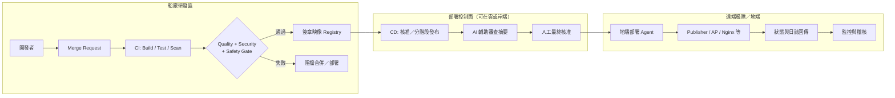

# DevOps — 艦隊雲地部署與交付設計

> 船廠研發 → 遠端艦隊部署的 CI/CD，以及雲端／地端系統架構。
> 本目錄為**文字 + 圖表**交付，不強制實作 Pipeline 程式碼。

---

## 文件索引

| 文件 | 內容 |
|------|------|
| [README.md](./README.md) | 本頁：範圍、CI/CD 總覽、與核心 demo 的關係 |
| [archit.md](./archit.md) | 雲地架構 Mermaid 圖、網路分區、Defense in Depth、設計說明 |

---

## 與核心 Side Project 的邊界

| 層級 | 範圍 | 交付物 |
|------|------|--------|
| **核心 MVP** | Publisher / Backend / Frontend + `docker-compose up` | 程式與容器 |
| **DevOps Option** | CI/CD（Quality / Security / Safety / AI）、雲地架構、HA、縱深防禦 | 本目錄文件與圖 |

核心鏈路仍是：

```text
GNSS Publisher (ROS2) → /gps/fix → FastAPI Bridge → WebSocket → Vue 地圖
```

上雲／地端拆分、Nginx、DB，見 `archit.md`。

---

## CI/CD Pipeline 總覽（船廠 → 遠端艦隊）

### 目標

研發在船廠合併變更後，經品質／資安／安全門檻，將簽章映像安全下發至遠端船艦（或岸端管控節點），並可回滾。

### 流程圖



### 四面向對照

| 面向 | 做法摘要 |
|------|----------|
| **Quality** | 單元／整合測試、型別與 lint、`docker-compose` smoke（topic echo / WS ping）、MR 必過 CI |
| **Security** | SCA／映像掃描（CVE）、密 掃描、簽章（Cosign）、最小權限 SA、Secret 不進 Git |
| **Safety** | 變更分級（監控類 vs 控制類）、金絲雀／單船試點、強制回滾劇本、部署窗口與雙人核准 |
| **AI 導入** | MR 風險摘要、測試缺口提示、日誌異常分類；**不取代**安全門檻與人工核准 |

### 建議階段

1. **Build**：多階段 Dockerfile 建 Publisher / Backend / Frontend 映像
2. **Verify**：測試 + SAST/SCA + 映像掃描
3. **Sign & Store**：簽章後推 Registry
4. **Promote**：dev → staging（岸端模擬船）→ production（指定船艦）
5. **Operate**：健康檢查、指標、稽核日誌、一鍵回滾

細部元件與信任邊界見 [archit.md](./archit.md)。

---

## 軟硬體角色速查（對題目 Nginx / AP / DB）

| 角色 | 建議落點 | 說明 |
|------|----------|------|
| **Nginx** | 雲 DMZ 與／或地端入口 | TLS 終止、反向代理、靜態前端、WS Upgrade |
| **AP** | 雲（營運 API）+ 地端（即時 Bridge） | 地端 AP 訂閱 ROS、推 WS；雲 AP 管帳號、艦隊清單、歷史查詢 |
| **DB** | 地端內網為主（熱資料）；雲可放冷資料／匯總 | 白名單存取；HA 見 `archit.md` |
| **ROS Publisher** | **僅地端**（船載／模擬機） | 低延遲、不依賴公網 |
| **CI/CD / Registry** | 雲或船廠內網 | 控制面與產物庫 |
