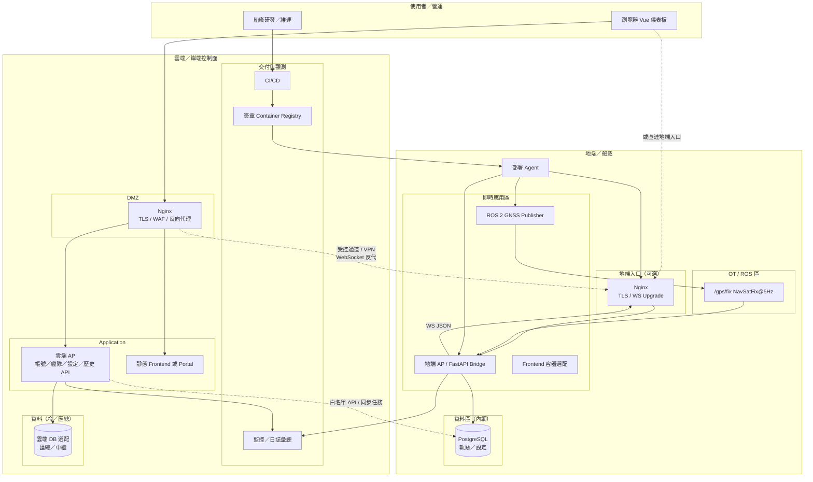
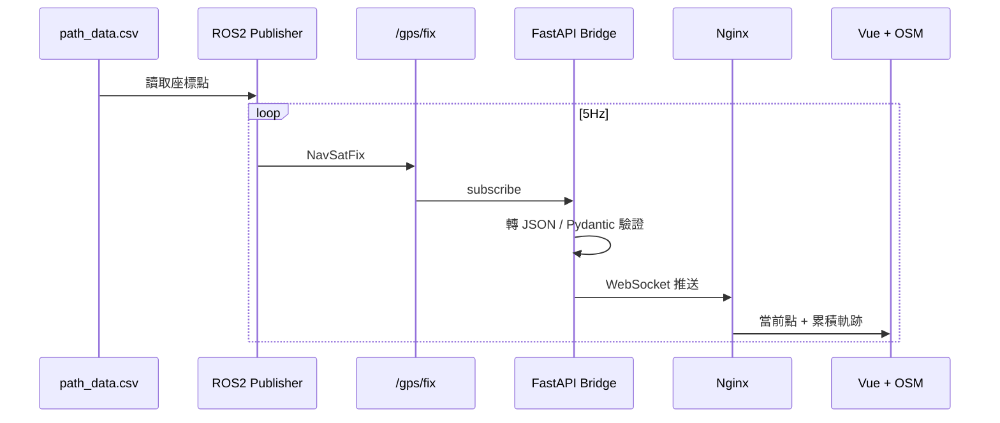
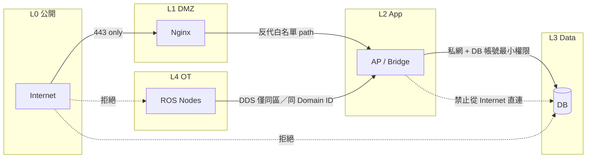
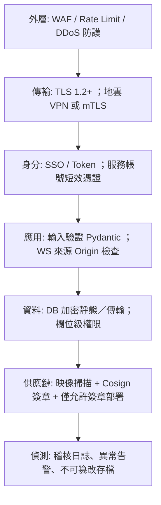
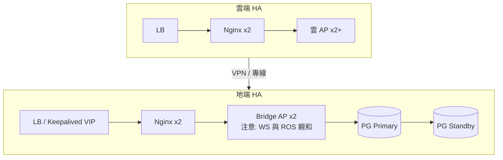

# 雲地系統架構（Mermaid）與設計說明

> 對應 Option：
    - 網路分區與存取控制
    - HA
    - Defense in Depth
> 主要服務：Nginx、AP、DB，以及 ROS Bridge、**監控**、**部署 Agent** 等。

---

## 1. 設計原則

| 原則 | 決策 |
|------|------|
| **即時鏈路留地端** | ROS 2 GNSS、`/gps/fix`、FastAPI WebSocket Bridge 跑在船載／地端，避免公網抖動影響 5Hz 監控 |
| **營運與交付上雲** | 帳號、艦隊清單、映像 Registry、CI/CD、彙總儀表板放雲端／岸端控制面 |
| **DB 預設內網** | 軌跡熱資料與設定庫在地端內網；雲端僅收匯總或經受控同步；API 來源白名單 |
| **分區隔離** | Internet → DMZ（Nginx）→ App → Data；地端 OT／ROS 區與 IT 監控區分離 |
| **縱深防禦** | TLS、WAF／Rate limit、mTLS／VPN 上雲、最小權限、簽章映像、稽核日誌層層疊加 |

對齊：**AP 可在雲（介面操作）+ 地端（WS 即時）**；**DB 在地端內網**；
瀏覽器經雲 Nginx 進入口後，即時座標可導向地端 WS（或經受控隧道）。

---

## 2. 雲地元件架構圖

---

## 3. 即時監控資料流（對齊核心需求）

**說明：** 核心 MVP 可無 Nginx／DB（compose 直連 Backend WS）。上圖是**產品化**後的標準路徑：Nginx 做 TLS 與 WS Upgrade；DB 為產品化持久化選配。

---

## 4. 網路分區與存取控制

### 存取控制清單（設計規格）

| 來源 | 目標 | 規則 |
|------|------|------|
| Internet | 雲／地 Nginx `:443` | 允許；強制 TLS |
| Internet | AP / DB / ROS | **拒絕** |
| Nginx | AP | 僅反代 `/api`、`/ws`；可加 mTLS（內網） |
| 雲 AP | 地端 DB／同步 API | **來源 IP 白名單** + 服務帳號 + 稽核 |
| ROS DDS | 僅 OT↔Bridge 網段 | 獨立 `ROS_DOMAIN_ID`；不對外暴露 |
| 維運 SSH／Agent | 跳板或 VPN | MFA；禁止萬用暴露 22 |

---

## 5. Defense in Depth（縱深防禦）

| 層級 | 對本專案的具體作法 |
|------|-------------------|
| 網路 | 分區、安全組、預設 deny |
| 邊界 | Nginx TLS、可選 WAF、僅開放必要 path |
| 身分 | OIDC／SSO + JWT；WebSocket 連線校驗；服務對服務用短效 token／mTLS |
| 應用 | JSON schema 驗證、WS 連線上限 |
| 資料 | DB 內網、備份加密、最少欄位暴露給雲 |
| 供應鏈 | CI 掃描 + 簽章映像才可進船 |
| 營運 | 變更分級、雙人核准（Safety） |

---

## 6. HA 設計（架構層摘要）

| 元件 | HA 策略 |
|------|---------|
| Nginx | 至少 2 節點 + LB／VIP；設定熱重載 |
| AP（無狀態 REST） | 水平擴展；LB 輪詢 |
| AP（WebSocket + ROS） | 黏性工作階段，或「單活躍 Bridge + Standby」避免 WS 狀態分裂 |
| DB | PostgreSQL 主備（streaming）+ 自動 failover（Patroni／雲托管） |
| Publisher | 主動／備援 Node；同一時間僅一節點發佈，避免雙活躍交錯軌跡 |

---

## 7. 哪些上雲？哪些地端？

| 上雲／岸端 | 留地端／船載 |
|------------|--------------|
| CI/CD、簽章 Registry | ROS 2 Publisher、DDS Topic |
| 帳號、權限、艦隊清單 | FastAPI 即時 Bridge、WebSocket |
| 匯總儀表板、告警彙整 | 軌跡熱資料 DB（可選） |
| 政策與設定下發 | Nginx 地端入口（可選） |
| 冷存檔／長期分析（選） | 部署 Agent、本機日誌緩衝 |

