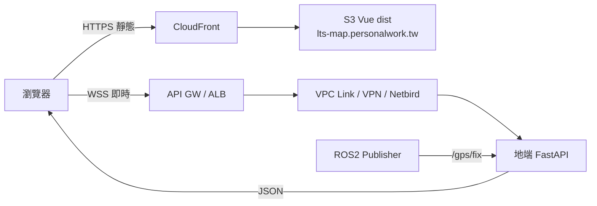

# Frontend — Vue 3 即時路徑地圖

> 對應需求：連接 Backend WebSocket，於 OpenStreetMap 標註**當前位置**並繪製**歷史路徑**。  
> 正式前端網域：**`https://lts-map.personalwork.tw`**

---

## 網域與職責

| 用途 | 網域／位址 | 說明 |
|------|------------|------|
| **前端地圖** | `https://lts-map.personalwork.tw` | Vue 3 `dist` 靜態站（建議 CloudFront → S3） |
| **即時 WS** | `wss://lts-api.personalwork.tw/ws` | 與 FastAPI／Swagger 同網域；**不**走 S3 |
| **本地開發** | `http://localhost:5173` | Vite dev server；WS 指 compose 內 Backend |

環境變數（建議）：

```bash
VITE_APP_ORIGIN=https://lts-map.personalwork.tw
VITE_WS_URL=wss://lts-api.personalwork.tw/ws
```

---

## 建議雲地架構（靜態上雲、WS 回地端）

```text
瀏覽器
  ├─ https://lts-map.personalwork.tw/*
  │       → CloudFront → S3 (Vue dist)
  │
  └─ wss://<api-host>/ws
          → API Gateway（或 ALB／雲上反代）
                │
    ┌───────────┼───────────────────┐
    ▼           ▼                   ▼
 VPC Link    Site-to-Site        Netbird 網段
 → NLB/ALB   VPN / DX            雲上 peer／反代
    │           │                   │
    └───────────┴───────────────────┘
                    ▼
           地端 FastAPI Bridge
           （訂 /gps/fix、推 GNSS JSON）
                    ▲
           ROS 2 GNSS Publisher @ 5Hz
```

### Mermaid



### 設計要點

| 項目 | 決策 |
|------|------|
| `dist` 託管 | **可以**放 S3；搭配 CloudFront + 自訂網域 `lts-map.personalwork.tw` |
| Domain → API GW → S3 | **不建議**當靜態站路徑；靜態走 CloudFront→S3 |
| WebSocket | 不可由 S3／純 Lambda 訂 ROS；需常駐 FastAPI |
| Netbird | 瀏覽器不直接加入 mesh；需雲上終止 `wss` 再轉地端 |
| SPA 路由 | History mode 需 CloudFront fallback 到 `index.html` |

---

## 功能對照（題目 3.3）

| 需求 | 實作方向 |
|------|----------|
| Vue 3 頁面 | Vite + Vue 3 + TypeScript（見 `package.json`） |
| WebSocket 即時資料 | 連 `VITE_WS_URL`；斷線自動重連 |
| 地圖 | Leaflet + OSM tiles |
| 當前位置 | `L.marker` 隨最新點更新 |
| 歷史路徑 | `L.polyline` 累積 lat/lng |

---

## 本地與建置

```bash
cd Frontend
npm install
npm run dev          # 開發
npm run build        # 產出 dist/
npm run preview      # 預覽 dist
```

部署到 `lts-map.personalwork.tw`：將 `dist/` 同步至 S3，CloudFront 綁定網域與 ACM 憑證。

---

## 相關文件

- 後端契約／擴充：`../Backend/more.md`
- 雲地與 HA：`../DevOps/archit.md`、`../DevOps/Advance.md`
