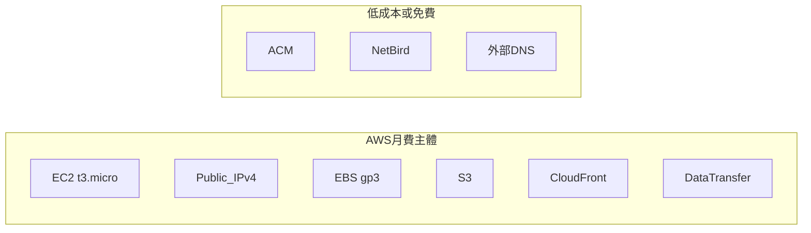

# 雲端資源成本估算（現行 LTS 架構）

> 基準日：2026-08-07  
> 區域：主要 `ap-northeast-1`（東京）；ACM／CloudFront 憑證在 `us-east-1`  
> 幣別：USD；換算僅供參考（約 **1 USD ≈ 32 TWD**）  
> 定價會變動，以 [AWS Pricing](https://aws.amazon.com/pricing/)／Billing Console 為準。

---

## 範圍說明

| 計入 AWS 帳單 | 不計入（本架構但非 AWS 或免費） |
|---------------|----------------------------------|
| EC2、EBS、公網 IPv4／EIP | 地端 Mac 電費／寬頻 |
| S3、CloudFront | NetBird Cloud（個人／免費額度，視方案） |
| 資料傳出（EC2／CloudFront） | DNS `personalwork.tw`（既有供應商，非 Route53） |
| | ACM 公有憑證（免費） |

---

## 現行資源清冊 ↔ 計費項

| 資源 | 識別／規格 | 計費方式 |
|------|------------|----------|
| EC2 | `i-035c3bc8c5a6a9c58`，`t3.micro`，On-Demand Linux | 按小時 |
| 公網 IP／EIP | `54.65.196.154` | 公網 IPv4 按小時（已掛載執行中實例仍計費） |
| EBS | 預設開機碟（估 gp3 ≈ 8 GB） | GB／月 |
| S3 | `lts-map-382334304827`（Vue `dist` ≈ 數百 KB） | 儲存 + 少量請求 |
| CloudFront | `E1DJ75OE6J486A`／`d3t9mbpb99roaq.cloudfront.net` | 傳出 GB + HTTP 請求 |
| ACM | `lts-map`（us-east-1）+ Caddy Let’s Encrypt（EC2） | ACM 免費；LE 免費 |
| NetBird | `lts-api-edge` ↔ `tazs-m1pro` | 視 NetBird 方案（通常個人額度內 ≈ $0） |

---

## 單價假設（估算用）

| 項目 | 假設單價 | 來源／備註 |
|------|----------|------------|
| EC2 `t3.micro` Tokyo On-Demand | **$0.0136 / 小時** | ≈ **$9.93 / 月**（730 小時） |
| 公網 IPv4 | **$0.005 / 小時** | ≈ **$3.65 / 月**（2024 起公網 IPv4 收費政策） |
| EBS gp3 8 GB（Tokyo） | 約 **$0.10–0.12 / GB·月** | ≈ **$0.8–1.0 / 月** |
| S3 Standard 儲存 | 約 **$0.025 / GB·月** | `dist` ≪ 1 GB → **≈ $0.01** |
| S3 → CloudFront | **$0** | Origin fetch 免費 |
| CloudFront 傳出（亞太） | 約 **$0.12–0.14 / GB**（超出免費額後） | 靜態站小檔＋快取命中率高 |
| CloudFront 請求 | 約 **$0.012 / 萬次 HTTPS** 量級 | demo 流量可忽略 |
| EC2 → 網際網路（API／WSS） | 約 **$0.114 / GB**（超出帳戶免費額後） | JSON 5Hz，單連線通常 ≪ 1 GB／月 |

「月」一律以 **730 小時** 估算。

---

## 情境估算（每月）

### A. 常駐開發／示範（現行 24×7，低流量）

假設：地圖每月傳出 **＜ 5 GB**（多數走 CloudFront 快取／Free Tier）、API／WSS **＜ 2 GB**、無大流量壓測。

| 項目 | 估計 USD／月 | 約 TWD／月 |
|------|-------------|-----------|
| EC2 `t3.micro` | 9.93 | ~318 |
| 公網 IPv4 | 3.65 | ~117 |
| EBS ~8 GB | 0.90 | ~29 |
| S3 + 請求 | 0.05 | ~2 |
| CloudFront（低流量） | 0–2 | 0–64 |
| EC2 傳出（低流量） | 0–1 | 0–32 |
| **合計（典型）** | **≈ $14–18** | **≈ 450–580** |
| **合計（偏保守上限）** | **≈ $20** | **≈ 640** |

> **結論：** 現行架構的帳單幾乎由 **EC2 + 公網 IPv4** 決定；靜態站與 Swagger／輕量 WS 通常只占少數。

### B. 只上班時開 EC2（約 8 小時／日 × 22 天 ≈ 176 小時）

| 項目 | 估計 USD／月 |
|------|-------------|
| EC2 | 176 × 0.0136 ≈ **2.39** |
| 公網 IPv4（關機仍可能保留 EIP） | 若 IP 仍保留：730 × 0.005 ≈ **3.65**；釋放則 → **$0** |
| EBS（關機仍計） | ≈ **0.90** |
| S3／CloudFront | 同低流量 **≈ 0–2** |
| **合計（關機但保留 EIP）** | **≈ $7–9** |
| **合計（關機並釋放 EIP）** | **≈ $3–5** |

### C. 完全拆除雲端入口（僅本機 compose）

AWS 月費 → **≈ $0**（刪 EC2／EIP／CF／S3 後）；地圖改本機 `:8080`，無正式網域。

---

## 流量敏感度（粗算）

| 額外用量 | 約增加成本 |
|----------|------------|
| CloudFront +10 GB／月（亞太） | +$1.2–1.4 |
| CloudFront +100 GB／月 | +$12–14 |
| EC2 API／WSS +10 GB 傳出 | +$1.1 |
| 地圖全站重整／無快取大量 miss | 同步抬高 CloudFront 請求與傳出 |

本專案 `dist` 總量約 **0.2 MB** 量級；訪客重複造訪幾乎只打快取，**流量成本通常遠低於 EC2 固定費**。

---

## 非 AWS／機會成本（知情）

| 項目 | 說明 |
|------|------|
| 地端 Mac | Docker + ROS 常開：電費與設備折舊（不進 AWS 帳單） |
| NetBird | 現行 Mesh 個人／團隊免費額內通常 $0；商業方案另計 |
| DNS | `personalwork.tw` 既有費用；未用 Route53 → 無 Hosted Zone 費（約 $0.50／區／月未發生） |
| Let’s Encrypt | Caddy 自動簽發，無 ACM／憑證費 |

---

## 省錢建議（不改架構精神）

1. **關機排程**：非展示時 `stop` EC2（記得 EIP 仍計 IPv4；長期不用可 release）。  
2. **改 `t4g.micro`（Graviton）**：同區通常略便宜，需確認映像為 arm64。  
3. **確認 Free Tier／CloudFront 額度**：新帳號或 flat-rate／免費額可把 CDN 費壓近 $0。  
4. **快取**：`deploy.sh` 已對靜態 asset 長快取、`index.html` 短快取，有利降低回源。  
5. **勿把大檔／錄影經 EC2 出口**：WS 僅 GNSS JSON；重流量走 CloudFront／S3。

---

## 與驗收環境對照

| 檢查 | 成本含義 |
|------|----------|
| `https://lts-map.personalwork.tw` | 主要 CloudFront＋S3（極低固定 + 依流量） |
| `https://lts-api.personalwork.tw/*` | EC2 固定費為主 + 少量 EC2 傳出 |
| Mac 睡眠導致 API 502 | 雲端 **EC2 仍在計費**；節省需主動 stop／terminate |

資源與部署腳本：[Deploy/README.md](./Deploy/README.md)  
架構說明：[todo.md](./todo.md)
