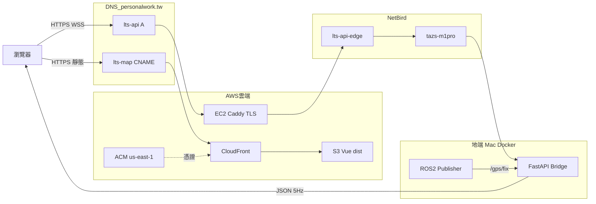
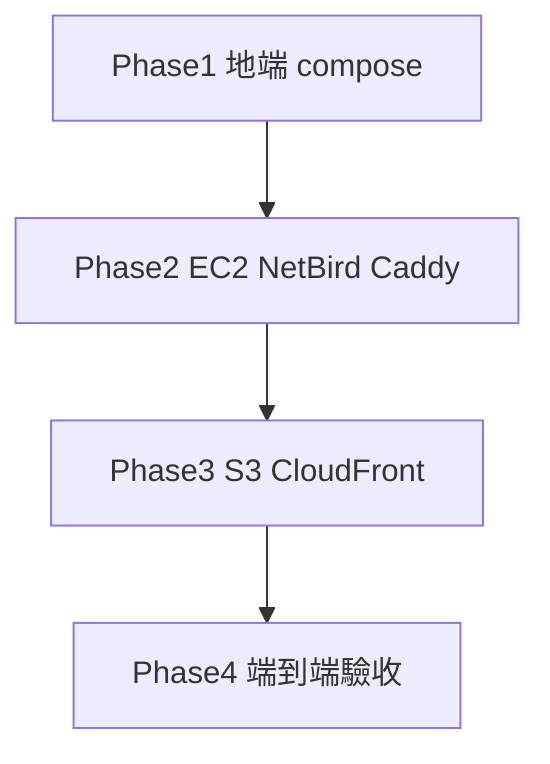

- [x] | `lts-map.personalwork.tw` | 前端地圖（Vue 3 `dist`／CloudFront → S3） |
- [x] | `CORS_ORIGINS` | `https://lts-map.personalwork.tw` | 允許的前端來源 |

--- netbird VPN --- 串接 AWS VPC／EC2 公網入口 --- `lts-api.personalwork.tw` <--> `tazs-m1pro.netbird.cloud`

- [x] | `lts-api.personalwork.tw` | FastAPI Bridge（REST、**Swagger**、**WebSocket** `/ws`） |

- [x] https://lts-api.personalwork.tw/docs

部署細節見 [`Deploy/README.md`](./Deploy/README.md)。


## 現行架構

瀏覽器不進 NetBird；靜態地圖上雲，即時 API 在地端 Docker，由 EC2 終止 TLS／WSS 後經 mesh 轉入。



| 網域 | 路徑 |
|------|------|
| `https://lts-map.personalwork.tw` | CloudFront → S3 `lts-map-382334304827` |
| `https://lts-api.personalwork.tw` | EIP `54.65.196.154` → Caddy → `tazs-m1pro.netbird.cloud:8000` |
| Swagger / WS | `/docs`、`wss://…/ws` |

---

## 實作步驟與雲端、地端配置流程



### Phase 1 — 地端（Mac／Docker）

| 步驟 | 服務／套件 | 配置內容 |
|------|------------|----------|
| 1 | Docker Compose `docker/docker-compose.yml` | 起動 `publisher` + `backend` +（可選）`frontend`；網路 `ltsnet`；映射 `8000:8000` |
| 2 | ROS 2 Publisher `lts-rosnode` | `ROS_DOMAIN_ID=0`；5Hz 發 `/gps/fix`（`NavSatFix`） |
| 3 | FastAPI Bridge `lts-api` | Uvicorn `:8000`；`/healthz`、`/docs`、`/ws`；`CORS_ORIGINS` 含 `https://lts-map.personalwork.tw` |
| 4 | NetBird（Mac client） | Peer FQDN：`tazs-m1pro.netbird.cloud`；開放 mesh 來源連入宿主 `8000` |
| 5 | 本機驗收 | `curl http://127.0.0.1:8000/healthz`；`ws://127.0.0.1:8000/ws` 收 GNSS JSON |

```bash
docker compose -f docker/docker-compose.yml up --build -d
```

### Phase 2 — 雲端入口（EC2 + NetBird + Caddy）

| 步驟 | 服務／套件 | 配置內容 |
|------|------------|----------|
| 1 | AWS SSO／CLI `AWS_PROFILE=…_Operations` | 區域 `ap-northeast-1`；建立 key pair `lts-api-edge` |
| 2 | `Deploy/ec2/provision-ec2.sh` | Default VPC 內建 EC2 `t3.micro`、SG（22／80／443／UDP 51820）、綁 EIP |
| 3 | DNS（非 Route53） | **A**：`lts-api.personalwork.tw` → `54.65.196.154` |
| 4 | `Deploy/ec2/bootstrap.sh` | 安裝 **Caddy** + **NetBird**；部署 `Caddyfile` |
| 5 | Caddy `Deploy/ec2/Caddyfile` | 網域 `lts-api.personalwork.tw`；Let’s Encrypt；`reverse_proxy tazs-m1pro.netbird.cloud:8000`（支援 WS Upgrade） |
| 6 | NetBird（EC2 peer） | Hostname `lts-api-edge`；SSO／Setup Key 入網；Groups／Access Policy：`server` ↔ `workstation`（至少 TCP 8000） |
| 7 | Security Group | 公網入站 80／443（SSH 22 僅維運）；不把 ROS／8000 開到公網 |
| 8 | 入口驗收 | EC2：`curl http://tazs-m1pro.netbird.cloud:8000/healthz`；公網：`https://lts-api.personalwork.tw/docs` |

### Phase 3 — 雲端前端（S3 + CloudFront）

| 步驟 | 服務／套件 | 配置內容 |
|------|------------|----------|
| 1 | Vite／Vue 3 建置 | `VITE_WS_URL=wss://lts-api.personalwork.tw/ws`、`VITE_APP_ORIGIN=https://lts-map.personalwork.tw` → `Frontend/dist/` |
| 2 | `Deploy/frontend/request-acm.sh` | ACM 憑證於 **`us-east-1`**（CloudFront 必要）；DNS 驗證 CNAME |
| 3 | `Deploy/frontend/provision-cloudfront.sh` | 私有 S3 + OAC；CloudFront 別名 `lts-map.personalwork.tw`；SPA 403／404 → `/index.html` |
| 4 | DNS | **CNAME**：`lts-map.personalwork.tw` → `d3t9mbpb99roaq.cloudfront.net` |
| 5 | `Deploy/frontend/deploy.sh` | `aws s3 sync dist/` + CloudFront invalidation `/*` |

### Phase 4 — 端到端驗收

| 檢查 | 預期 |
|------|------|
| `https://lts-map.personalwork.tw` | 地圖頁 200、無混合內容 |
| `https://lts-api.personalwork.tw/docs` | Swagger UI |
| `https://lts-api.personalwork.tw/healthz` | `{"status":"ok",…}` |
| `wss://lts-api.personalwork.tw/ws` | 約 5Hz GNSS；地圖繪路徑 |
| CORS | 前端 origin 為 `lts-map` 時不擋 |
| Mac 睡眠／NetBird 斷線 | API 502；恢復後自動回來 |

### 配置落點速查

| 位置 | 改什麼 |
|------|--------|
| 地端 `docker/docker-compose.yml` | CORS、埠、ROS_DOMAIN_ID、映像建置 |
| 地端 NetBird App | Mac peer 名稱／群組（workstation） |
| 雲端 `Deploy/ec2/*` | EC2／SG／EIP、Caddy 上游 FQDN、bootstrap |
| 雲端 NetBird 管理台 | EC2 peer 群組（server）、Access Policy |
| 雲端 `Deploy/frontend/*` | ACM、S3、CloudFront、deploy |
| DNS 供應商 | `lts-api` A、`lts-map` CNAME、ACM 驗證 CNAME |

更完整指令與清冊：[`Deploy/README.md`](./Deploy/README.md)。
